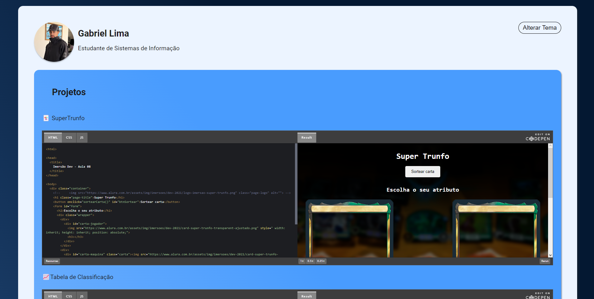

# Imersão DEV ALURA

>Trilha Explorer

Projeto construído no evento Imersão Dev da Alura.

[Clique aqui para acessar](https://limanada.github.io/imersao-ALURA/)

# 🖥️ Tecnologias
  - HTML
  - CSS
  - GitHub

Foi muito divertido poder participar de um evento como esse e com a comunidade toda se ajudando! 

>É só o começo!!! 🙃

# 📨 Contato
https://www.linkedin.com/in/gabri-el/